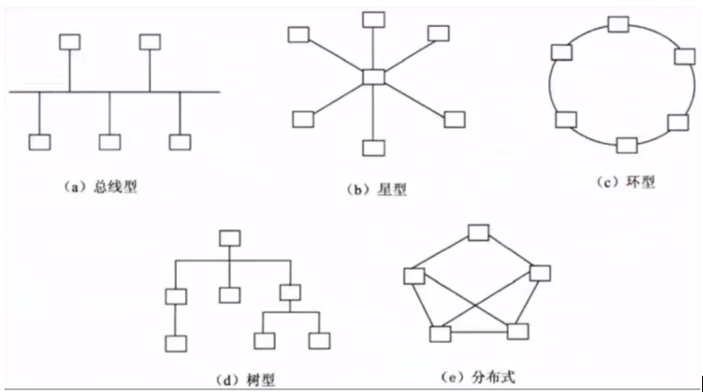

### 1. 网络分类
- 局域网：LAN 一定范围
- 城域网：MAN 城市
- 广域网：WAN 国家/全球

### 2. 网络拓扑结构



- 总线型结构：利用率低、成本低
- 星型结构：交换机形成的局域网、中央负荷大
- 环型结构：流动方向固定、难以扩充
- 树型结构：总线型的扩充、分级结构
- 分布式结构：任意节点连接、管理成本高

### 3. ISO/OSI网络体系结构
- 7.物理层：二进制传输
- 6.数据链路层：封装成帧传送，传送至局域网的物理主机上
- 5.网络层：分组传输和路由选择，传送至互联网的网络主机上
- 4.传输层：端口到端口的传输
- 3.会话层：会话管理服务、建立、维护、结束
- 2.表示层：数据间格式转换、压缩、加密等操作，对数据进行处理
- 1.应用层：实现具体的功能、进程上的通讯

### 4. 网络互联硬件
```txt
{
    7.物理层：中继器(扩大信号)、集线器Hub(多路中继器)
    6.数据链路层：网桥(分析帧地址)、交换机(Mac地址表)
    5.网络层：路由器(路由选择)
    1.应用层：网关(协议转换)  {
        FTP文件传输协议
        Telnet远程登录协议
        SMTP电子邮件协议
        NFS网络文件服务协议
        SNMP网络管理协议
    }
}
```

### 5. TCP/IP模型结构
- 4.网络接口层：Wi-Fi
- 3.网络层：IP (网际协议), ICMP, IGMP, ARP, RARP, OSPF, BGP
```txt
{
    ARP和RARP：地址解析协议，ARP将ip地转换为物理地址，RARP是将物理地址转换为IP地址
}
```
- 2.传输层：TCP/UDP
```txt
{
    TCP：3次握手2次ACK机制 
    {
        1'停止等待协议：理论教学理解/已淘汰，发送一个分组之后停止传输，每发一帧就等待ACK    [传输效率比较低]
        2'连续ARQ协议：滑动窗口协议的具体实现机制和核心，哪个帧超时只传输哪一个
        3'滑动窗口协议：TCP协议的核心/流量控制协议，可以连续发送多个分组，不需要每发一帧就等待ACK   [窗口的大小决定了传输的效率]
    }
    UDP：不可靠连接，一般用于视频音频传输
}
```
- 1.应用层：HTTPS/HTTP
```txt
{
    可靠传输：FTP、Telnet、SMTP、HTTP、HTTPS(基于ssl加密)
    不可靠传输：TFTP、SNMP、DHCP(动态分配IP地址协议)、DNS
}
```

### 5. 路由选择策略
- 静态路由：每个网络节点存储一张表格，从固定的路由表中查出对应的目的节点及所应选择的下一节点，适合小型网络
- 动态路由：路由之间交换路由表信息，并根据算法自动计算和更新路由表，适合大型网络
```txt
{
    距离-向量算法（只发给邻居）：
        周期性向邻居发送整个路由表（只知道距离和方向）
        实现简单，开销较小，易产生路由环路
        度量标准：通常使用跳数，最大有效跳数为15，16跳视为不可达
    
    链路-状态算法（发全部）：
        触发式向所有路由器洪泛链路状态信息（拥有整个网络的完整拓扑图）
        “洪泛发送”：每个路由器向整个区域的所有路由器广播信息，但广播的内容是与之相连的链路的状态
        收敛速度快，不易产生路由环路，初始洪泛LSP会消耗较多带宽以及内存
}
```

### 6. IP地址
- IPV4 地址分四段，每段8位，共32位二进制数组
```txt
{
    A类地址：0.0.0.0-127.255.255.255        默认子网掩码：255.0.0.0 或 /8
    B类地址：128.0.0.0-191.255.255.255      默认子网掩码：255.255.0.0 或 /16
    C类地址：192.0.0.0-223.255.255.255      默认子网掩码：255.255.255.0 或 /24
}
```
- 子网划分,常规的VLSM方法
```txt
场景：公司有一个网络 192.168.1.0/24。需要划分给3个部门；部门A: 60台主机，部门B: 30台主机，部门C: 12台主机
{
    1'确定子网个数、子网位数
    部门A：2^n - 2 >= 60   =>   n=6	 =>  子网掩码位数(32-6=26)，四级IP借位2位(26-24)
    部门B：2^n - 2 >= 30	  =>   n=5	 =>  子网掩码位数(32-5=27)，四级IP借位3位(27-24)
    部门C：2^n - 2 >= 12	  =>   n=4	 =>  子网掩码位数(32-4=28)，四级IP借位4位(28-24)


    2'每个子网的IP地址范围和可用机子
    部门A网络：
        网络地址： 192.168.1.0
        子网掩码： 255.255.255.192    二进制：11000000 -> 十进制：2^7+2^6=192
        网络范围： 192.168.1.1/24 - 192.168.1.62/24
        广播地址： 192.168.1.63/24

    部门B网络：
        网络地址： 192.168.1.64
        子网掩码： 255.255.255.224    二进制：11100000 -> 十进制：2^7+2^6+2^5=224
        网络范围： 192.168.1.65/24 - 192.168.1.94/24
        广播地址： 192.168.1.95/24

    部门C网络：
        子网掩码： 255.255.255.240    二进制：11110000 -> 十进制：2^7+2^6+2^5+2^4=224
        网络范围： 192.168.1.97/24 - 192.168.1.110/24
        广播地址： 192.168.1.111/24
}
```
- IPV6 地址长度128位

### 7. 网络安全
- 物理威胁、网络攻击、身份鉴别、编程威胁、系统漏洞
- 防火墙->IDS->SSL协议
```txt
{
    防火墙：是在内部网络和外部因特网之间增加的一道安全防护措施
    {
        网络技术防火墙：层次低、效率高
        应用级防火墙：层次高、效率低
     }
}
```
- 常见的网络攻击
```txt
{
    口令入侵：利用某些合法的账号或者口令登录主机，再实施攻击
    特洛伊木马：程序后台，发送IP地址到预定端口
    拒绝服务：DDOS攻击，服务瘫痪
    IP欺骗：伪造为某个受信任的主机，绕过基于IP地址的身份验证，伪造IP包
    鉴权欺骗/会话劫持：窃取Cookie、劫持Session、令牌
    中间人攻击：窃听、拦截、篡改通信；ARP欺骗（伪造ARP表-IP、MAC地址映射表）, DNS欺骗
}
```
- 网络安全体系设计
```txt
{
    物理安全层：保护网络设备、服务器、通信线路等硬件实体免受物理破坏
    网络边界安全层：防范外部互联网的威胁，防火墙\入侵防御系统\VPN网关\DDoS高防
    网络内部安全层：内网防火墙、网络访问限制
    主机系统安全层：操作系统补丁、防病毒软件、身份认证/权限管理
    应用与数据安全层：数据库备份和灾容、应用防火墙（SQL注入、XSS、CSRF）、数据加密脱敏、数据库审计
}
```
- 数字签名/数字证书
```txt
{
    数字签名：哈算计算，不参与加密过程、验证签名、确定发送方的真实性、身份认证
    数字证书：验证发送方和公钥关系；发送方和公钥关系绑定
}
```