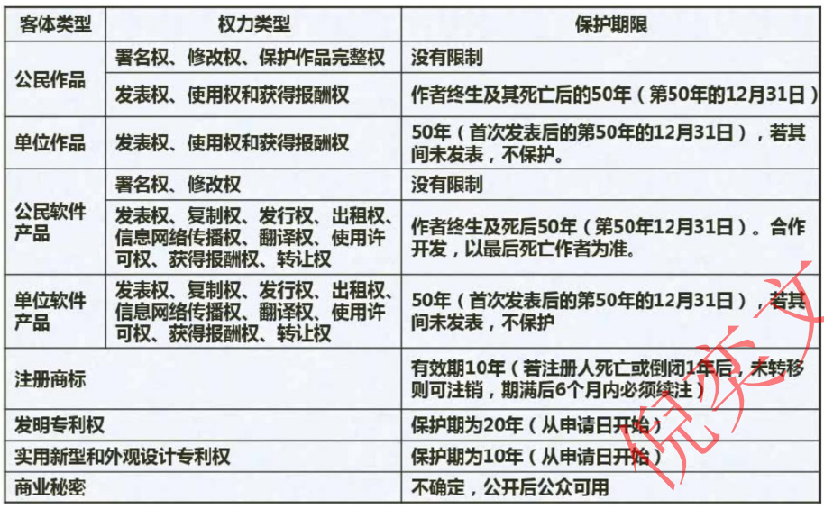
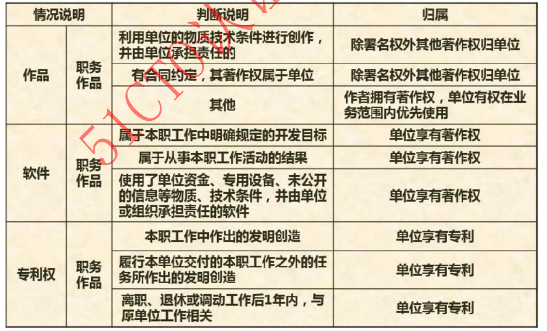
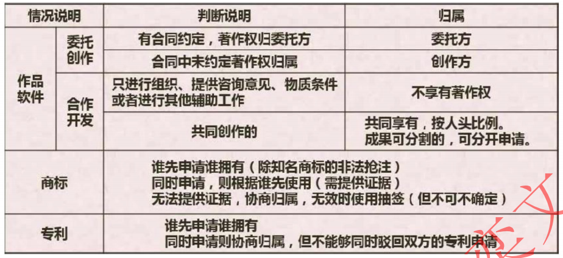
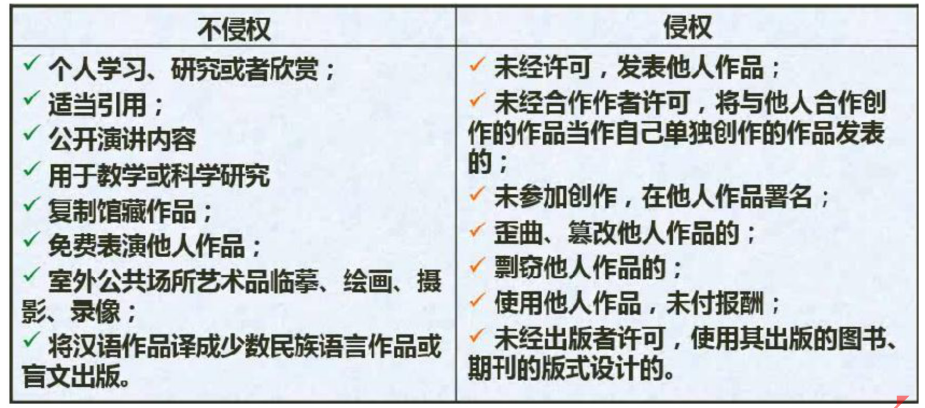

### 1. 标准分类
- 国际标准：ISO/IEC+标准号+冒号+发布年号
- 国家标准：强制国家标准GB；推荐国家标准GB/T  [GB-中国；ANSI-美国；BS-英国；JIS-日本]
- 行业标准：GJB-中国军用标准；IEEE-美国电气电子工程师协会；MIT-S-美国军用标准
- 区域标准：地区标准 ARSO-非洲地区标准化组织
- 地方标注：一级行政机构定制的标准

### 2. 知识产权
```txt
{
    著作权：保护表达形式。代码一旦被写出，无论是否注册，都自动享有著作权
           职务作品：在绝大多数情况下，你在职期间为完成工作任务所开发的代码，其著作权归属于公司，署名权自己
           保护期限：自软件开发完成之日起自动产生，无需登记 {
                个人作品：作者终生及其死亡后50年（截止于第50年的12月31日）
                单位作品：首次发表后50年（截止于第50年的12月31日）                    
            }
    
    专利：保护思想，保护技术方案和发明创造（例如：一种新的分布式事务处理方法、一种高效的图像压缩算法）。保护力度强，但申请复杂、周期长、费用高
         关键点：新颖性，必须是前所未有的
         职务作品：你在工作中做出的创新发明，申请权也归公司
         保护期限：发明专利权自申请日起 20 年，实用新型和外观设计自申请日起 10 年
         申请原则：谁先申请归谁，如同一天申请，需协商或抽签
         
    商标：保护品牌标识，如软件名称、Logo、产品名称（例如：IntelliJ IDEA?, Windows?）
         保护期限：需要商标局注册，10年，可续
         申请原则：谁先申请归谁，如同一天申请，谁先使用归谁（要证据），都没用，协商或抽签
    
    商业机密：不为公众所知悉、具有商业价值并经权利人采取相应保密措施的技术信息和经营信息（如：源代码、算法、客户名单、营销策略等）
         保护方式：无固定时长，一般企业决定，不能延长，需签订保密协议
}
```







### 3. 著作权（版权） / 计算机软件著作权
- 著作权（版权）：人身权(发表权、署名权、修改权、保护作品完整性权) ; 财产权(使用权、获得报酬权)  [署名权、修改权、保护作品完整性权保护期间没有限制]
- 计算机软件著作权：著作人身权(发表权、开发者身份权/署名权) ; 著作财产权(使用权、复制权、发行权、翻译权、注释权、信息网络传播权、出租权、转让权、使用许可权和获得报酬权)

### 4. 计算机软件著作权的行使
- 1.许可使用权
    
    独占许可使用：权利人授权给他人之后，不能再授权第三方，自己不可使用
     
    独家许可使用：权利人授权给他人之后，不能再授权第三方，自己可使用
     
    普通许可使用：权利人授权给他人之后，可授权第三方，自己可使用
     
- 2.转让使用权

    必须签订书面合同，可定期或者永久，但不因转让而改变软件的保护期限
    
    出卖、赠予、抵押、赔偿

### 5. 实际工作
- 开源软件合法：检查许可证（License）

- 使用SCA工具：建议使用软件成分分析（SCA）工具（如Black Duck, Snyk）来扫描和管理第三方依赖的许可证及安全风险

```txt
{
    宽松许可证（MIT, Apache, BSD）：可商用，但需保留版权声明
    Copyleft 许可证（GPL, LGPL）：高危！使用其代码的衍生作品也必须开源。商业项目慎用，务必咨询法务
}
```

#### 考点
- 合作开发无书面协议时，当软件可分割，各自享用该部分软件著作权；软件不可分割，共同享有著作权。任何一方不得单独行使软件的转让权。

- 委托开发或接受任务开发无书面协议，软件著作权归受托人（实际开发人）所有。

- 未经合作者同意将共同开发的软件当作自己的作品发表或登记 属于侵权行为

- 以学习和研究软件内含的设计思想和原理为由，通过安装、显示、传输或存储软件的方式使用软件时，可以不经许可，不支付报酬。

- 专利申请日（关键日）是专利局或专利局指定的专利申请受理代办处收到完整专利申请的文件日期，邮寄以寄出的邮戳日为准。

