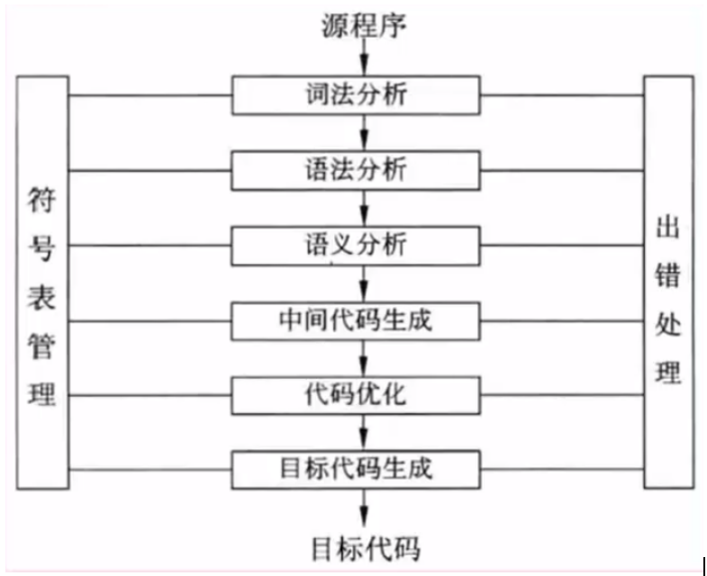
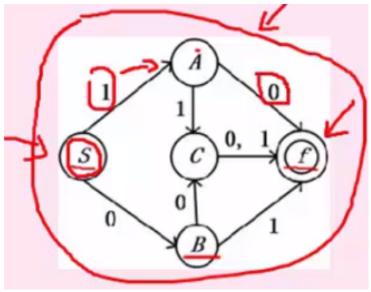

### 1. 各语言特点
- 低级语言：机器语言（计算机硬件只能识别0和1的指令程序），汇编语言
- 高级语言：功能更强，抽象级别更高，与人们使用的自然语言比较接近

### 2. 编译程序基本原理
- 词法分析 -> 语法分析 -> 语义分析 -> 中间代码生成 -> 代码优化 -> 目标代码生成



```txt
{
    1.词法分析: 将源代码字符流拆解为词法单元（Token）。[正则表达式、有限自动机（DFA/NFA）]
    2.语法分析: 根据语法规则（如上下文无关文法 CFG）将Token序列构建为语法树（AST）[递归下降分析法、LR分析法（如Yacc/Bison）]
    3.语义分析: 检查AST的语义合法性（类型匹配、作用域、声明是否重复等）
    4.中间代码生成: 生成IR
    5.代码优化: 优化IR
    6.目标代码生成: 将优化后的IR转换为目标机器代码（汇编或二进制）

    源代码 → 词法分析 → Token流(3型文法) → 语法分析 → AST(2型文法)  
              → 语义分析 → 带标注AST → 中间代码生成 → IR  
              → 代码优化 → 优化IR → 目标代码生成 → 可执行文件
}
```

### 3. 有限自动机
- 有限自动机(DFA)，DFA转移函数是单值的
- 非确定有限自动机(NFA)，NFA允许多值转移


```txt
S输入1，得到A输入0 得到F
S输入1，得到A输入1 ,得到C输入0,1 得到F
S输入0，得到B输入0 得到F
S输入0，得到B输入1，得到C输入0,1 得到F
每一条线路都是唯一的，得出此图为确定有限自动机
```

#### 考点
- 传值调用[不变值]和传址调用[变值]

- 通过转移函数画出初态到终态的路径（状态转换图）