### 1. 软件生存周期
- 1'可行性分析、项目开发计划  ->  可行性报告、项目开发计划
- 2'需求分析               ->   软件需求说明书     
- 3'概要设计               ->   选择系统解决方案,规划子系统、概要设计说明书
- 4'详细设计               ->   设计子系统内部具体实现、详细设计文档
- 5'编码                  -> 
- 6'测试                  ->   软件测试计划、测试用例、测试报告
- 7'维护                  ->

### 2. 软件过程 
- CMM 仅需改进纯软件开发流程的小型团队；CMMI 是集成模型，覆盖软件、硬件、系统工程等多种领域企业
- CMM CMM 只有阶段式一种结构（5个等级）；CMMI 有阶段式和连续式两种表示法
- CMMI 是 CMM 的进化版和替代品。现在普遍使用的是CMMI
- 统一过程UP：起始阶段->精化阶段->构建阶段->移交阶段

### 3. 五个成熟度等级

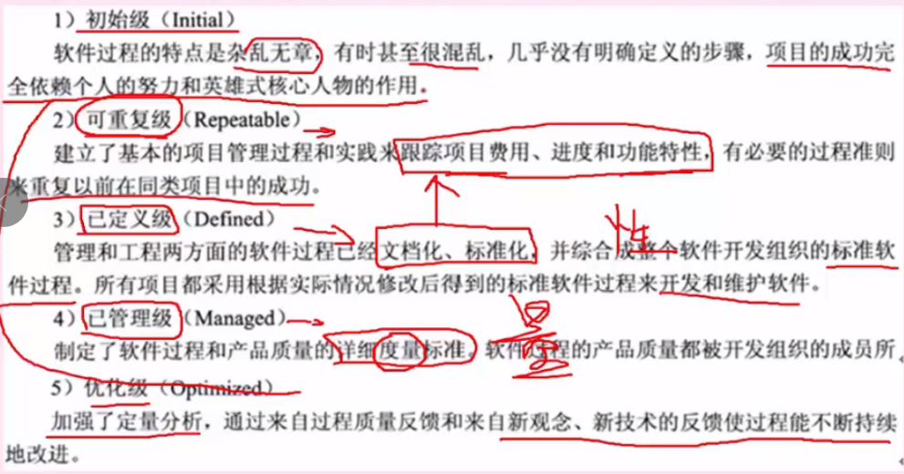

- 初始化：过程不可预测，混乱，依赖个人英雄主义
- 可重复级：建立了基本的项目管理，能够跟踪成本、进度、功能，可重复以往的成功
- 已定义级：过程已标准化，文档化
- 已管理级：定量管理，为过程和产品制定量化的质量目标
- 优化级：加强定量分析、产品反馈，持续过程改进

### 4. 关键过程域
- 二级（可重复级）：需求管理、软件项目计划、软件项目追踪和监督、软件子合同管理、软件质量保证、软件配置管理**
- 三级（已定义级）：集成软件管理、软件产品工程**、同行评审**
- 四级（已管理级）：定量过程管理、软件质量管理
- 五级（优化级）：缺陷预防、技术变更管理、过程变更管理

### 5. 软件过程模型

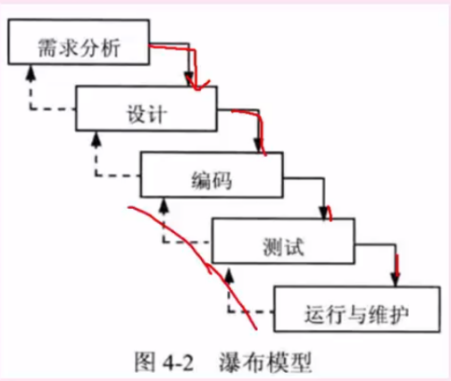

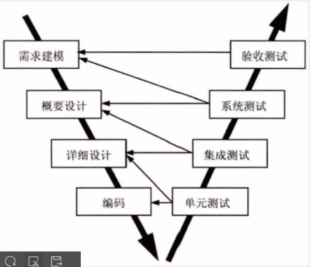

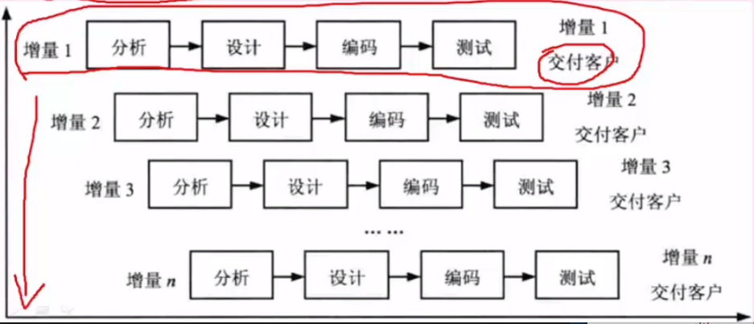

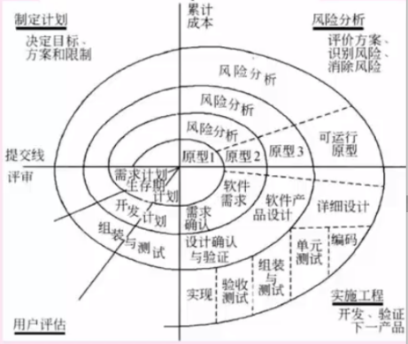

```
{
    瀑布模型：pic-1
        📝 特点：阶段严格顺序（需求→设计→编码→测试→维护），文档驱动，前一阶段完成后才能进入下一阶段
        ✅ 优点：结构清晰，易于管理
        ❌ 缺点：缺乏灵活性，后期需求变更成本高
        🌟 适用场景：需求明确、变更少的项目 [航天系统]
    
    瀑布V模型：pic-2
        📝 特点：瀑布模型的变体，强调测试与开发并行设计，每个开发阶段对应一个测试阶段
        ✅ 优点：早期规划测试，减少缺陷
        ❌ 缺点：仍无法适应需求变化
        🌟 适用场景：高可靠性系统 [医疗设备]

    增量模型：pic-3
        📝 特点：将系统拆分为多个增量模型，分批交付，每个增量完成完整开发周期
        ✅ 优点：早期交付部分功能，降低风险
        ❌ 缺点：具有不稳定性，可能根基没打好
        🌟 适用场景：核心功能明确但可分期交付的项目 [电商平台]

    原型模型：
        📝 特点：快递构建一个功能模型，中间在不断地沟通和演示，最终确定原型
        ✅ 优点：快速验证需求和设计，减少不确定性

    迭代模型：
        📝 特点：通过多次迭代完善系统，每次迭代产出可运行版本，需求在迭代中调整
        ✅ 优点：灵活应对变化，持续验证设计
        ❌ 缺点：管理复杂
        🌟 适用场景：需求模糊的创新项目 [AI算法开发]

    螺旋模型：pic-4
        📝 特点：结合迭代和瀑布模型，每轮迭代包含风险分析，四步走：制定计划->风险分析->落地实施->客户评估
        ✅ 优点：强调风险管理，适合高风险项目
        ❌ 缺点：成本高，需专业风险评估
        🌟 适用场景：需求不明确，风险项目 [国防软件]     

    喷泉模型：
        📝 特点：迭代、无间隙、面向对象
        ❌ 缺点：过于复杂

    敏捷模型：
        📝 特点：小周期（Sprint）交付，持续反馈，拥抱变化
        ✅ 优点：快速响应需求变化，客户参与度高
        ❌ 缺点：需高自律团队，不适合强合规领域
        🌟 适用场景：互联网产品、初创公司

    DevOps模型：
        📝 特点：开发（Dev）与运维（Ops）协同，自动化CI/CD流水线，强调持续交付与监控
        ✅ 优点：云原生应用、高频更新服务

    统一过程模型：
        📝 特点：一种以“用例和风险驱动，以架构为中心，迭代并增量”的开发过程，起始阶段->精化阶段->构建阶段->移交阶段
}
```

### 6. 敏捷开发特点

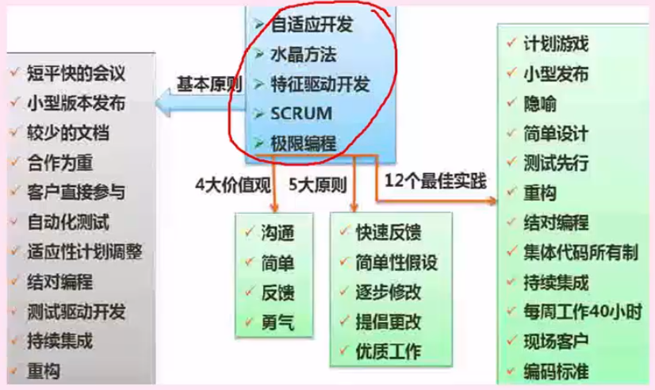

- 结对编程：一个程序员开发，另一个代码审查，共同负责
- 自适应开发：强调开发的适应性
- 水晶方法：针对每一个项目需要一套不同的策略、约定和方法论
- 极限编程XP：简化流程、测试优先，文档其次
- 并列争球法：一种迭代的增量化过程，每隔一段时间30天一次的迭代称为一个冲刺，按需求优先级，多个组织和小组并行递增实现产品
- 敏捷统一过程AUP：大型上连续，小型上迭代构建软件系统

### 7. 软件需求分析
- 需求规约：即需求定义，目的是为了编写需求文档，在双方间达成一个共识
- 需求验证：需求开发节点的复查手段，需求验证通过后，要请用户签字确认，作为验收标准之一，此时，这个需求规格说明书就是需求基线
- 需求风险管理：带有风险的做法有：无足够用户参与、忽略了用户分类、用户需求的不断增减、模棱两可的需求、不必要的特性、过于精简的srs,不准确的估算
- 需求跟踪：双向跟踪，两个层次，正向跟踪表示用户原始需求是否都实现了，反向跟踪表示软件实现的是否都是用户要求的

### 8. 软件测试
- 测试原则
```txt
{
    1.尽早测试
    2.避免开发人员参与
    3.合理的测试用例
}
```
- 测试阶段
```txt
{
    单元测试：对单个模块进行测试，有程序员自己测试模块内部的接口
    集成测试：将模块组合起来进行测试
    确认测试：功能上的测试，Alpha测试（开发）、Beta测试（生产）
    系统测试：负载测试、强度测试、并发测试
    回归测试 软件修改错误或变更后，进行回归测试以验证之前正确的代码是否引入了错误
}
```
- 测试方法
```txt
{
    动态测试：{
        黑盒测试：功能性测试，不了解软件代码结构，根据功能设计用例，测试软件功能
        白盒测试：结构性测试，明确代码流程，根据代码逻辑设计用例，进行用例覆盖
    }
    静态测试：对代码进行人工审查 {
        桌签审查：程序员自己检查编写的程序，在程序编译后，单元测试前
        代码审查：若干个程序员和测试人员组成评审小组，通过召开评审会议来进行审查
        代码走查：开会来进行审查，由测试人员提供测试用例，让程序员扮演计算机的角色，手动运行测试用例，检查代码逻辑
    }
}
```
- 测试策略：自顶向下、自底向上、三明治（既有自底向上也有自顶向下，兼有二者的优点，但是工作量大）
- 调试：蛮力法、回溯法（从出错的地方开始向回找）、原因排错法（找出所有可能的原因，逐一进行排除，具体包括演绎法、归纳法、二分法）
- 测试用例设计
```txt
{
    黑盒测试：input and output {
        测试阶段：功能测试、系统测试、验收测试
        测试依据：需求设计说明书，用户手册、设计文档
        测试用例设计方法：{
            等价类划分：将输入数据划分为若干等价类，从每个类中选取一个代表值进行测试
            边界值划分：对输入数据的边界值进行测试
            状态迁移图：测试系统在不同状态之间转换时的行为
            因果图：通过分析输入条件（因）和输出结果（果）之间的关系来设计测试用例
        }
    }

    白盒测试：根据代码逻辑设计 {
        测试阶段：单元测试、集成测试
        测试依据：源代码、详细设计文档
        测试用例设计方法：{
            语句覆盖：每条执行语句至少执行一遍
            判定覆盖：每个判断的真假至少执行一遍
            条件覆盖：每个条件至少满足一遍
            判定/条件：同时满足判定覆盖和条件覆盖
            条件组合覆盖：多个条件组合的情况至少满足一遍
            路径覆盖：设计用例覆盖程序中所有可能的执行路径
        }
    }
}
```

### 9. 软件项目管理
- 项目估算模型
```txt
{
    COCOMO：基于代码行（KLOC）和成本驱动因子（产品、平台、人员、项目属性）
        📝 适合场景 [中后期，技术方法较明确]

    功能点分析（FPA）：从用户视角评估软件功能规模（5大组件：输入、输出、查询、内部文件、接口文件），再转换为工作量 
        📝 适合场景 [项目早期，需求阶段]

    WBS（工作分解结构）：将项目逐层分解为小的、可估算的工作包，自下而上汇总估算 
        📝 适合场景 [各阶段，尤其适用于详细规划]

    德尔菲法（Delphi）：组织多位专家背靠背进行多轮匿名估算和反馈，直至达成共识
        📝 适合场景 [缺乏历史数据、创新性项目]

    类比估算：依据过去类似项目的实际数据，来推测新项目的估算
        📝 适合场景 [项目早期，信息不足时]

    * * COCOMO看代码，类比靠历史，WBS拆任务，德尔菲靠专家
}
```
- Grantt图/甘特图

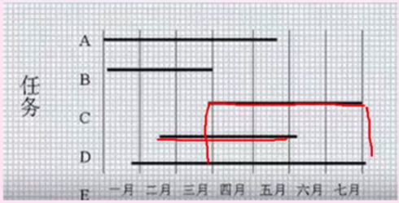

```txt
{
    1.包含 任务列表（纵向轴）、时间刻度（横向轴）、横条、里程碑、进度条、关键路径要素
    2.能够反映活动间的并行关系，但无法反映活动之间的依赖关系
    3.关键路径即最长路径 {
        案例：{
            A. 煮饭（20分钟）   B. 洗菜切菜（10分钟）   C. 炒菜（15分钟，需要等B完成后才能开始）
            A独立进行，B -> C ； 最长的路径是 B -> C（25分钟），这就是关键路径
        }
 
        是网络图中最长路径、可以有多条关键路径、关键路径上的任务浮动时间一定为零
    }
}
```
- Pert图/前趋图

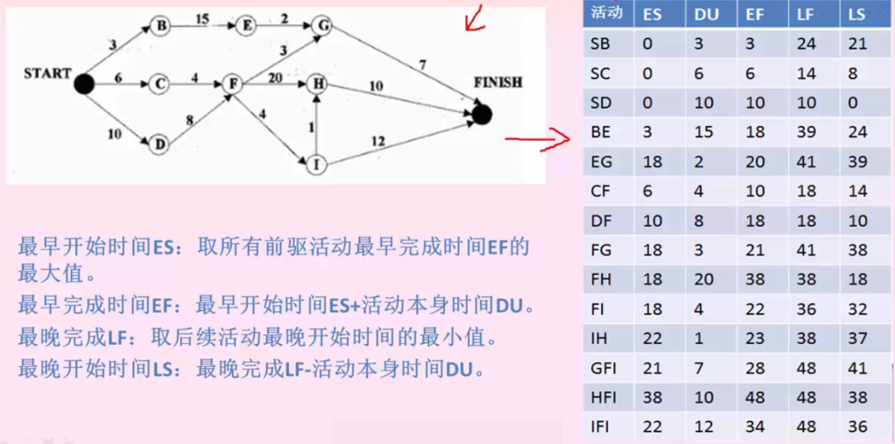

```txt
{
    1.包含 节点、剪头、虚剪头（不消耗时间资源）要素
    2.反映活动之间的依赖关系，有向边上标注活动的开始时间、结束时间、完成时间，但无法反映活动之间的并行关系
    3.三时估计法：最乐观时间O、 最可能时间M、 最悲观时间P
    4.计算 {
        期望工期（Te）：Te = (O + 4M + P) / 6
        方差（σ?）： σ? = [(P - O) / 6]?
    }
    5.关键路径：最短工期、花费时间最长的事情、松弛时间为0
    {
        单一路径最长：最长即是
        多条路径最长：需要顺推计算、逆推计算来算总浮动时间，TF=0即是
    }
    6.松弛时间：不影响工期的前提下，被推迟完成的最大时间
}
```
- 软件项目组织
```txt
{
    组织结构模式：项目型（项目经理）、职能型（部门经理）、矩阵型（二者皆有）
    程序设计小组组织方式： {
        主程序员小组：主程序员全权负责，后援程序员必要时可代替主程序员，适合大规模项目
        民主制小组：无主程序员，决策全是成员参与投票，适合于项目规模小
        层次式小组：两个层次，一名组长领导若干个高级程序员；每个高级程序要领导若干个程序员
    }
}
```

### 10. 软件配置

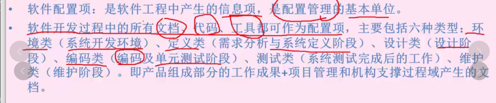

- 基线、软件配置项、版本控制、变更控制

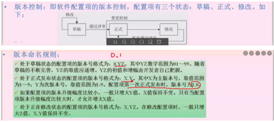

### 11. 软件质量

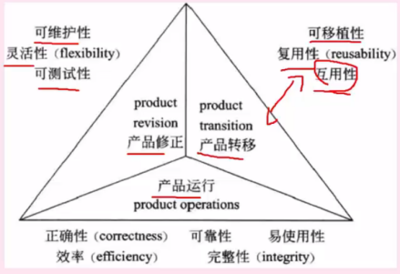

### 12. 软件度量
- 外部属性：一般为性能指标，可直接测量
- 内部属性：产品的可靠性，间接测量