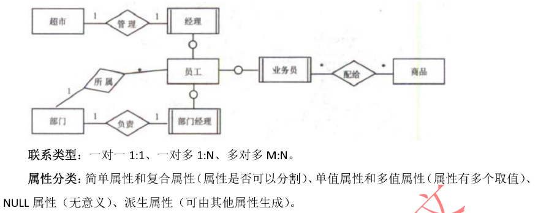
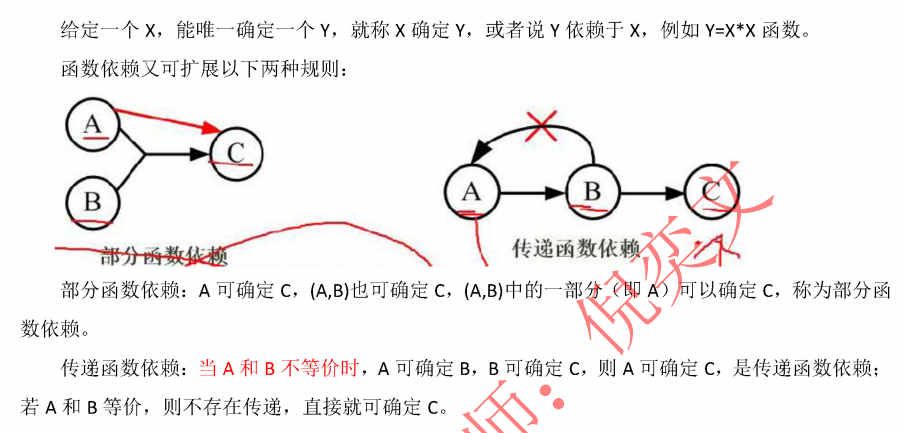
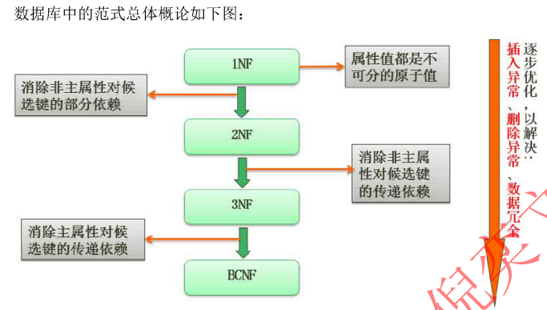
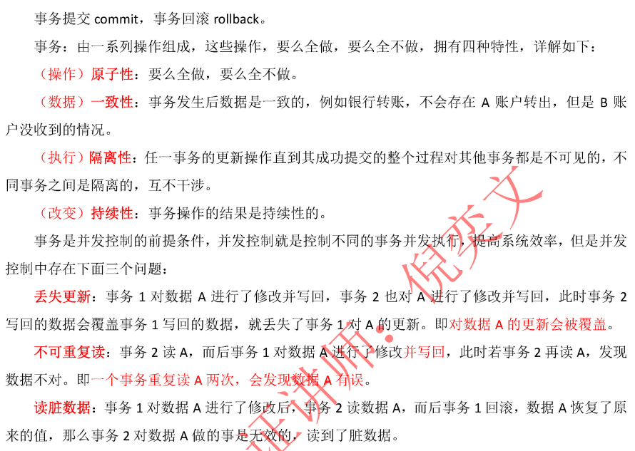
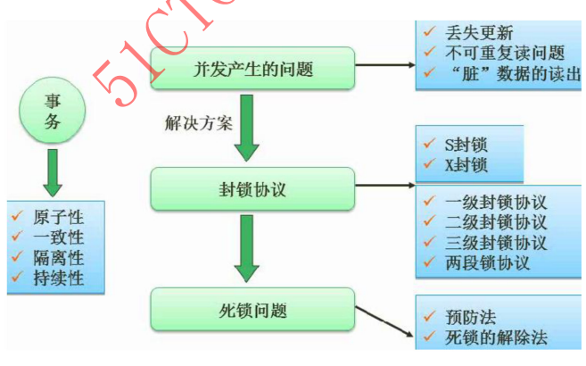

### 1. 三级模式
- 外模式：子模式/用户模式，不同数据库用户能看到不同的视图，一个数据库可以有多个外模式 [视图]
- 模式：概念模式/逻辑模式/全局模式，所有用户的公共视图。一个数据库只有一个概念模式，位于三级结构的中间层 [表]
- 内模式：存储模式/物理模式，一个数据库只有一个内模式，直接与操作系统交互 [数据物理结构和存储方式]

### 2. 二级映像
- 外模式-概念模式映像：视图和表的映射，数据的逻辑独立性
- 概念模式-内模式映像：表和物理数据存储的映射，数据的物理独立性

### 3. 数据模型
- 概念数据模型：ER图



```txt
{   
    实体：用矩形表示，每个实体由一组属性表示，包括主键、候选键、外键。
    联系：用菱形表示，分为一对一（1:1）、一对多（1:n）、多对多（m:n）。
    属性：用椭圆表示，是实体某方面的特性。E-R 模型中的属性分为：①简单和复合属性；②单值和多值属性；③null属性；④派生属性。
}
```
- 基本数据模型：DBMS来实现，有层次模型、网状模型、关系模型、面向对象模型

### 4. 关系代数运算
- 并∪：两张表中所有记录数合并，相同记录只显示一次 [UNION]
- 交∩：两张表交集相同记录 [EXISTS]
- 差-：S1-S2,结果是S1表中有而S2中没有的那些记录
- 笛卡尔×：两表相乘 [CROSS JOIN / SELECT * FROM A,B]
- 连接⨝：与笛卡尔积类似，但是相同名称的属性列只显示一次 [LEFT JOIN, RIGHT JOIN, FULL OUTER JOIN（MySQL不支持）]
- 自然连接：与连接类似，显示等值的记录 [INNER  JOIN]
- 投影π：条件选列; π<姓名,年龄> [SELECT 列1, 列2]
- 选择σ：选行;σ<条件>(R) [WHERE]

### 5. SQL
- grant 授权、revoke 回收

### 6. DBMS分类
- 关系型数据库系统 RDBS
- 面向对象数据库系统 OODBS
- 对象关系数据库系统 ORDBS  （R关系、OO面向对象、DBS数据库）

### 7. 函数依赖



- 完全依赖：X→Y，即Y依赖X
- 部分依赖：A→C，AB→C，即C部分依赖于AB
- 传递依赖：A→B→C（AB不等价），即C传递依赖于A

### 8. 函数规范化
- 超键：唯一标识元组的一个或者多个集合；{学号}/{学号,身份证号,年龄}
- 候选键：最小的超键，具有唯一性标识、值不能为NULL；一个表可以存在多个{学号}
- 主键：主键都是候选键，但并非所有候选键都是主键



- 1'第一范式 1NF：原子性、有主键、无重复行，字段单一类型单一值
- 2'第二范式 2NF：满足1NF，且不存在部分依赖；非主键列必须完全依赖于整个主键
- 3'第三范式 3NF：满足2NF，且不存在传递依赖非
- 闭包：A? = A，A 推导出的所有属性的集合

### 9. 模式分解
- 1'无损连接分解：把一个表拆分成多个小表后，还能通过自然连接（JOIN）完全恢复原始数据，不丢失任何信息。

`{分解 ρ = {R1, R2}，若 R1 ∩ R2 → R1 或 R1 ∩ R2 → R2 成立，则分解是无损的}`

- 2'保持函数依赖分解：保持着原先的依赖关系

### 10. 分解算法
- 3NF分解算法（无损且保持依赖）
```txt
{
    原始关系：R(A,B,C,D)，函数依赖：{AB→C, C→D, D→A}  
    分解为：
        R1(A,B,C)（对应AB→C）
        R2(C,D)（对应C→D）
        R3(D,A)（对应D→A）          
}
```

- BCNF分解算法（无损但不一定保持依赖）
```txt
{
    原始关系：R(A,B,C,D)，函数依赖：{A→B, B→C}
    1.候选键”        (AD)? = R(A,B,C,D)
    2.检查BCNF违反“   A? = ABC ≠ ABCD，B? = BC ≠ ABCD，都违背了，随机选一个
    3.分解”          R1(A,B) [A→B]， R2(A,C,D) [剩余属性]
                    R1(B,C) [B→C]， R2(A,B,D) [剩余属性]      不满足条件，废弃
    4.检查R1,R2
}
```

### 11. 事务



### 12. 数据备份
- 静态转储：转储期间数据库不做任何变动操作；优点快，直接覆盖，缺点需停机维护，只能恢复某个节点上 [金融、医疗]
- 动态转储：转储期间数据变动、事务可以并行；优点秒级恢复，缺点过程复杂 [电商、社交]
- 海量转储：all in
- 增量转储：接着上次
- 日志文件：支持实时恢复，因为记录了数据库的操作

### 13. 封锁协议



- 共享锁/S锁，读锁； 排它锁/X锁，写锁
- 1PL 一级封锁协议：事务修改前加X锁，事务结束释放
- 2PL 二级封锁协议：在一级封锁协议的基础上，读取数据得加上S锁，读完释放
- 3PL 三级封锁协议：在一级封锁协议的基础上，读取数据得加上S锁，事务结束释放[银行、金融核心系统]